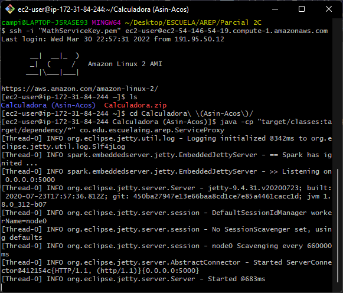
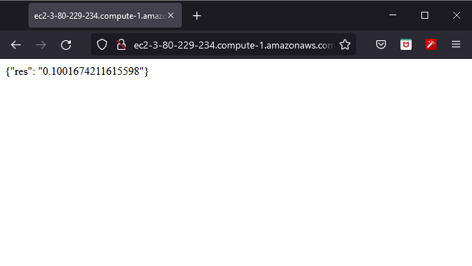
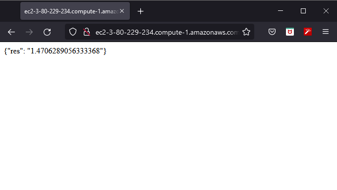

# Parcial Segundo Corte AREP
#### Camilo Andrés Pichimata Cárdenas
##### 30 de Marzo del 2022

## Enunciado
Diseñe un prototipo de calculadora de microservicios que tenga un servicios de matemáticas con al menos dos funciones implementadas y desplegadas en al menos dos instancias virtuales de EC2. Además debe implementar un service proxy que recibe las solicitudes de servicios y se las delega a las dos instancias usando un algoritmo de round-robin. Asegúrese que se pueden configurar las direcciones y puertos de las instancias en el porxy usando variables de entorno del sistema operativo. Cada estudiante debe seleccionar para desarrollar dos funciones matemáticas de acuerdo a los dos últimos dígitos de su cédula como se especifica en la lista (Si sus dos últimos dígitos de su cédula son el mismo use el siguiente dígito que sea diferente). Todas las funciones reciben un solo parámetro de tipo "Double" y retornan una parámetro de tipo "Double".


En este caso las funciones implementadas fueron `Acos` y `Asin`.

# Despliegue en Amazon (EC2)

Para realizar el despliegue se crearon 3 instancias del servicio de EC2:


En este caso se podía acceder a las máquinas a través de las siguiente direcciones:

```bash
# Service proxy
http://ec2-3-80-229-234.compute-1.amazonaws.com

# Math Services 1
http://ec2-54-146-54-19.compute-1.amazonaws.com

# Math Services 2
http://ec2-54-235-229-173.compute-1.amazonaws.com
```

Para conectarse a las instancias mediante `ssh` se usaron los siguientes comandos:

```bash 
# Service proxy
ssh -i "Proxy.pem" ec2-user@ec2-3-80-229-234.compute-1.amazonaws.com

# Math Services 1
ssh -i "MathServiceKey.pem" ec2-user@ec2-54-146-54-19.compute-1.amazonaws.com

# Math Services 2
ssh -i "MathServiceKey2.pem" ec2-user@ec2-54-235-229-173.compute-1.amazonaws.com
```

Para cargar los archivos necesarios para correr la aplicación implementada se hizo uso de una conexión `sftp`, para esto se cambia el protocolo en los comandos presentados anteriormente. Para subir los archivos estos se comprimen en un .zip y se usa el método `put` para cargarlo a las diferentes instancias. Se termina la conexión con el comando exit y se conecta de nuevo mediante `ssh`.

Para descomprimir los archivos cargados se hace uso del comando `unzip` seguido del nombre del archivo a descomprimir.

En las tres máquinas era necesario instalar java para poder correr los servicios, para esto se utilizó el siguiente comando:

```bash
# Comando para instalar java
sudo yum install java-1.8.0
```

Después de terminada la instalación de Java para ejecutar el programa e inicializar el servicio se hace uso de los siguientes comandos:

```bash
# Service proxy
mvn exec:java -Dexec.mainClass="co.edu.escuelaing.arep.ServiceProxy"

# Math Services
mvn exec:java -Dexec.mainClass="co.edu.escuelaing.arep.MathServices"
```

Para cada una de las instancias al correr los servicios se muestra una salida similar a la siguiente:



Se realizaron las siguietes pruebas para verificar el funcionamiento del Api con cada una de las funciones implementadas:

```bash 
# Url consultada:
http://ec2-3-80-229-234.compute-1.amazonaws.com:5000/asin?value=0.1
```



```bash
# Url consultada:
http://ec2-3-80-229-234.compute-1.amazonaws.com:5000/acos?value=0.1
```



Puede ver el video de la ejecusión dando [click aquí](video/Video.mp4).